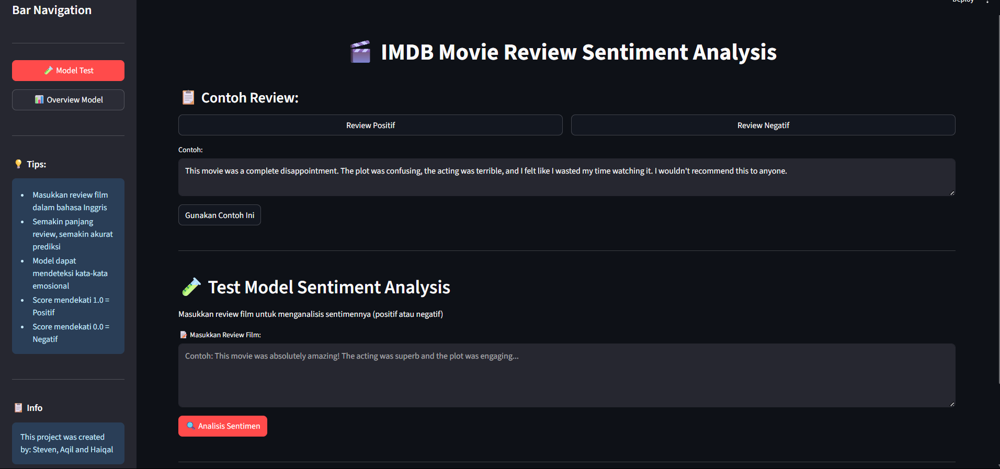
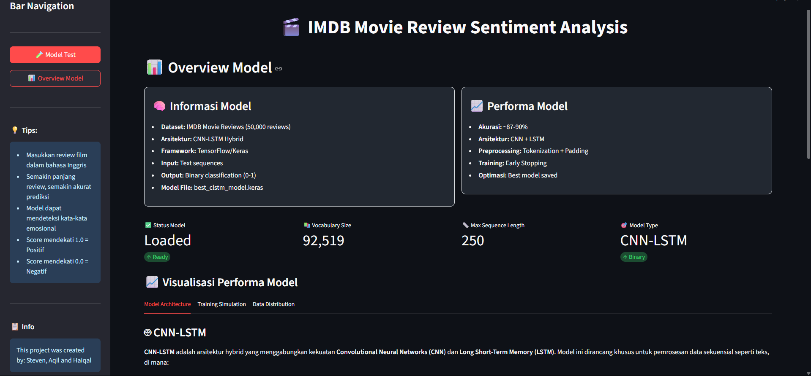

# [Try the website](https://sentimentanalyst-c-lstm.streamlit.app/)

# Sentiment Analyst C-LSTM

Proyek ini adalah implementasi analisis sentimen menggunakan arsitektur **Convolutional Long Short-Term Memory (C-LSTM)** pada data teks. Notebook [`code.ipynb`](code.ipynb) memuat seluruh pipeline mulai dari preprocessing, pembuatan model, pelatihan, evaluasi, hingga prediksi.

---

# Documentation





---

## Alur Kode Secara Detail
### 1. **Preprocessing Data**
- **Load Data:** Data teks dan label sentimen dibaca dari file (misal CSV).
- **Dataset:** Dataset yang digunakan diunduh dari Kaggle:  
  [Sentiment140 dataset with 1.6 million tweets](https://www.kaggle.com/datasets/kazanova/sentiment140)
- **Cleaning:** Teks dibersihkan (lowercase, hapus tanda baca, dsb).
- **Tokenisasi:** Teks diubah menjadi urutan angka menggunakan tokenizer Keras.
- **Padding:** Setiap urutan dipadatkan (`pad_sequences`) agar memiliki panjang yang sama.
- **Split Data:** Data dibagi menjadi data latih, validasi, dan uji.

### 2. **Pembuatan Model C-LSTM**
- **Embedding Layer:** Mengubah token menjadi vektor representasi kata.
- **Convolutional Layer (Conv1D):** Menangkap fitur lokal (n-gram) dari urutan kata.
- **Long Short-Term Memory (LSTM):** Menangkap dependensi jangka panjang dalam urutan fitur hasil Conv1D.
- **Dense Layer:** Menghasilkan output akhir berupa prediksi sentimen (positif/negatif).

#### **Penjelasan Kerja C-LSTM**
- **C-LSTM** menggabungkan keunggulan CNN dan LSTM:
  - **CNN (Conv1D):** Mengekstrak fitur spasial (misal frasa penting) dari teks.
  - **LSTM:** Memahami urutan dan konteks fitur-fitur tersebut dalam kalimat.
- Pada kode, urutan layer biasanya:
  1. **Embedding**
  2. **Conv1D**
  3. **LSTM**
  4. **Dense (Output)**
- Proses ini memungkinkan model memahami baik pola lokal maupun konteks global dalam teks.

### 3. **Pelatihan Model**
- Model dikompilasi dengan loss function (misal `binary_crossentropy`) dan optimizer (misal Adam).
- Model dilatih pada data latih, divalidasi pada data validasi.
- History pelatihan (akurasi, loss) disimpan untuk analisis.

### 4. **Evaluasi Model**
- Model diuji pada data uji.
- Metrik yang dihitung: akurasi, presisi, recall, F1-score.
- Hasil evaluasi ditampilkan di output notebook.

### 5. **Prediksi Data Baru**
- Teks baru diproses seperti data latih.
- Model memprediksi sentimen dan menampilkan hasilnya.

---

## Penjelasan C-LSTM pada Kode

Pada notebook, arsitektur C-LSTM dibangun seperti berikut:

```python
from keras.models import Sequential
from keras.layers import Embedding, Conv1D, LSTM, Dense

model = Sequential()
model.add(Embedding(input_dim=VOCAB_SIZE, output_dim=EMBEDDING_DIM, input_length=MAX_LEN))
model.add(Conv1D(filters=128, kernel_size=5, activation='relu'))
model.add(LSTM(64))
model.add(Dense(1, activation='sigmoid'))
```

- **Embedding:** Mengubah kata menjadi vektor numerik.
- **Conv1D:** Menangkap pola lokal (misal frasa penting).
- **LSTM:** Memahami urutan dan konteks fitur dari Conv1D.
- **Dense:** Output prediksi sentimen.

---

## Hasil

- Model menghasilkan metrik evaluasi (akurasi, presisi, recall, F1-score) pada data uji.
- Hasil prediksi pada data baru juga ditampilkan.

---

## Cara Menjalankan

1. Pastikan dependensi (Keras, TensorFlow, dsb) sudah terinstall.
2. Unduh dataset dari Kaggle:  
   [Sentiment140 dataset with 1.6 million tweets](https://www.kaggle.com/datasets/kazanova/sentiment140)
3. Jalankan notebook [`code.ipynb`](code.ipynb) secara berurutan.
4. Lihat hasil evaluasi dan prediksi pada output cell.

---

**Catatan:**  
- File `preprocessing_objects.pkl` diperlukan untuk preprocessing.
- Model dapat dikembangkan lebih lanjut untuk kebutuhan produksi.
- Repo ini merupakan salinan (clone) dari repo tim, dengan penyesuaian dokumentasi agar dapat ditampilkan sebagai portofolio pribadi.  
    Versi deploy asli: https://sentimentanalyst-c-lstm.streamlit.app/
    Versi deploy saya: https://movies-sentiments.streamlit.app/
